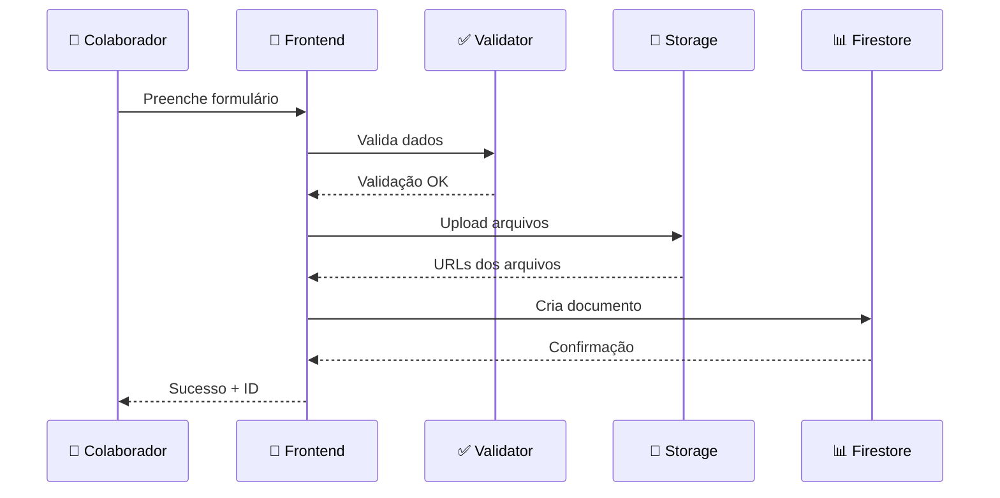
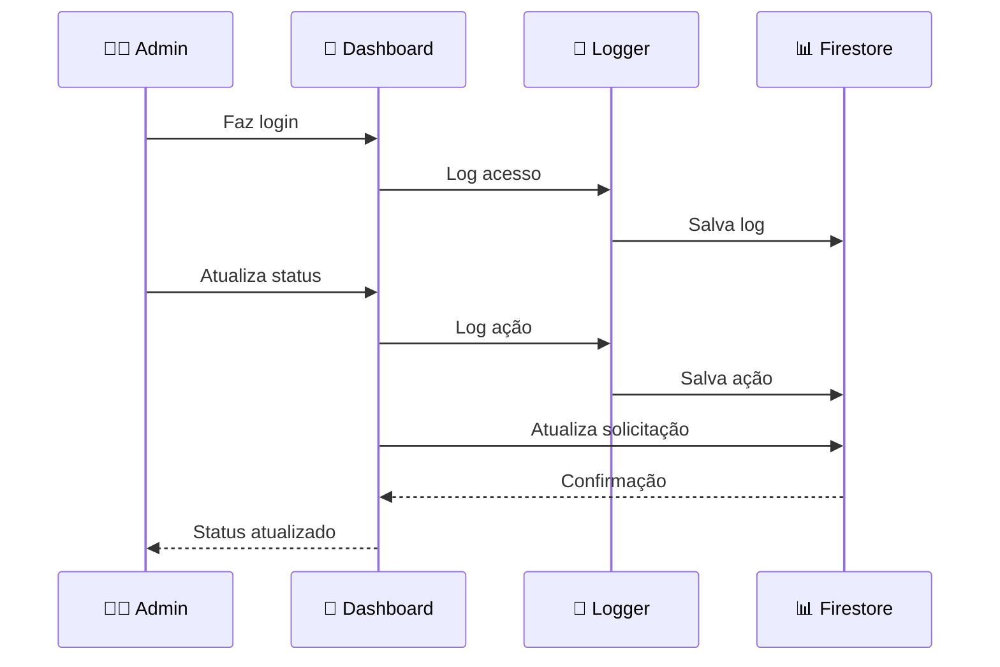
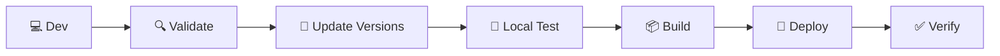

# 🏗️ Arquitetura do Sistema - SENAI Lab


## 📋 Visão Geral da Arquitetura

O **SENAI Lab** é um sistema web moderno construído com arquitetura **serverless** utilizando Firebase como backend completo. A solução é projetada para máxima simplicidade, escalabilidade e custo-benefício, aproveitando o plano gratuito do Firebase para operação 100% gratuita.

## 🏛️ Diagrama de Arquitetura

```
┌─────────────────────────────────────────────────────────────┐
│                    🌐 FRONTEND (Client-Side)                │
├─────────────────────────────────────────────────────────────┤
│  📱 index.html          │  🔐 admin.html                    │
│  (Colaboradores)        │  (Interlocutores)                 │
│                         │                                   │
│  ✅ Formulários         │  ✅ Dashboard                     │
│  ✅ Upload arquivos     │  ✅ Gestão solicitações           │
│  ✅ Validações          │  ✅ Relatórios PDF                │
│  ✅ Preview images      │  ✅ Auditoria                     │
└─────────────────────────────────────────────────────────────┘
                              │
                              ▼
┌─────────────────────────────────────────────────────────────┐
│                   🔥 FIREBASE SERVICES                      │
├─────────────────────────────────────────────────────────────┤
│                                                             │
│  📊 Firestore           💾 Storage          🌐 Hosting      │
│  (Database NoSQL)       (Arquivos)         (Web App)       │
│                                                             │
│  ✅ Solicitações       ✅ PDFs             ✅ SPA           │
│  ✅ Auditoria         ✅ Imagens          ✅ SSL/TLS       │
│  ✅ Logs              ✅ STLs             ✅ CDN Global    │
│  ✅ Analytics         ✅ Documentos       ✅ Cache         │
└─────────────────────────────────────────────────────────────┘
                              │
                              ▼
┌─────────────────────────────────────────────────────────────┐
│                    🔒 SECURITY LAYER                        │
├─────────────────────────────────────────────────────────────┤
│  🛡️ Firestore Rules    │  🔐 Admin Auth   │  📝 Audit Log  │
│  Controle de acesso    │  Senha local     │  Rastreamento   │
└─────────────────────────────────────────────────────────────┘
```

## 🧩 Componentes da Arquitetura

### **🌐 Frontend Layer**

#### **📱 Cliente Web (Vanilla JavaScript)**
```javascript
// Estrutura modular do frontend
senai-lab-webapp/public/
├── index.html              // Interface colaboradores
├── admin.html              // Dashboard administrativo
└── assets/
    ├── css/               // Estilos modularizados
    │   ├── common.css     // Estilos compartilhados
    │   ├── admin/         // CSS específico admin
    │   └── index/         // CSS específico index
    └── js/                // JavaScript modularizado
        ├── shared/        // Funções compartilhadas
        ├── frontend/      // Lógica do index.html
        ├── admin/         // Lógica do admin.html
        └── config/        // Configurações
```

#### **🎯 Características Técnicas**
- **Framework**: Vanilla JavaScript (sem dependências)
- **Bundling**: Não utilizado (performance otimizada)
- **CSS**: Modularizado por funcionalidade
- **Responsividade**: Mobile-first design
- **PWA**: Service Worker para cache offline

### **🔥 Firebase Backend**

#### **📊 Firestore Database**
```javascript
// Estrutura do banco de dados NoSQL
{
  "solicitacoes": {
    "doc_id": {
      "id": "auto_generated",
      "nomeCompleto": "string",
      "whatsapp": "string", 
      "tipoServico": "string",
      "status": "pendente|em_andamento|concluido|cancelado",
      "prioridade": "baixa|media|alta",
      "timestamp": "timestamp",
      "dadosServico": "object", // Específico por tipo
      "arquivos": "array",      // URLs do Storage
      "comentarios": "array",   // Histórico admin
      "auditoria": "array"      // Log de alterações
    }
  },
  "auditoria": {
    "access_logs": "collection", // Logs de acesso
    "action_logs": "collection"  // Logs de ações
  }
}
```

#### **💾 Firebase Storage**
```
senai-arquivos/
├── IMPRESSAO_20250715_123000_JOAO_documento.pdf
├── IMPRESSAO_3D_20250715_140500_MARIA_modelo.stl
├── MANUTENCAO_20250715_160000_PEDRO_foto1.jpg
└── ...

Nomenclatura: TIPO_DATA_HORA_SOLICITANTE_ARQUIVO.ext
```

#### **🌐 Firebase Hosting**
- **CDN Global**: Distribuição mundial automática
- **SSL/TLS**: Certificados automáticos
- **Compressão**: Gzip automático
- **Cache**: Headers otimizados
- **Custom Domain**: Suporte a domínios personalizados

## 🔒 Segurança e Autenticação

### **🛡️ Modelo de Segurança**

#### **📊 Firestore Security Rules**
```javascript
rules_version = '2';
service cloud.firestore {
  match /databases/{database}/documents {
    // Solicitações: Criação pública, gestão administrativa
    match /solicitacoes/{document} {
      allow create: if true;  // Formulário público
      allow read, update, delete: if true;  // Admin (senha local)
    }
    
    // Auditoria: Somente escrita
    match /auditoria/{document} {
      allow create: if true;
      allow read: if false;  // Dados sensíveis
    }
    
    // Bloquear todo o resto
    match /{document=**} {
      allow read, write: if false;
    }
  }
}
```

#### **🔐 Autenticação Administrativa**
```javascript
// Sistema de autenticação local (sem Firebase Auth)
const ADMIN_CONFIG = {
  password: 'senha_segura',           // Hash SHA-256 recomendado
  sessionDuration: 24 * 60 * 60 * 1000, // 24 horas
  sessionKey: 'senai_admin_session',  // LocalStorage key
  maxLoginAttempts: 3,                // Prevenção brute force
  lockoutDuration: 15 * 60 * 1000     // 15 minutos bloqueio
};
```

### **🔍 Sistema de Auditoria**

#### **📝 Tipos de Logs**
```javascript
// 1. Logs de Acesso (access_logs)
{
  "userId": "admin_user_id",
  "timestamp": "2025-07-15T10:30:00Z",
  "action": "login|logout",
  "ip": "192.168.1.100",
  "userAgent": "Mozilla/5.0...",
  "sessionDuration": "3600000" // apenas logout
}

// 2. Logs de Ações (action_logs)  
{
  "userId": "admin_user_id",
  "timestamp": "2025-07-15T10:35:00Z", 
  "action": "status_change|comment_add|delete|export",
  "targetId": "solicitacao_id",
  "oldValue": "pendente",
  "newValue": "em_andamento",
  "details": "object" // Dados adicionais
}
```

## 🔄 Fluxo de Dados

### **📋 Fluxo de Criação de Solicitação**



### **🔐 Fluxo de Gestão Administrativa**



## 🏗️ Padrões de Desenvolvimento

### **📐 Arquitetura Frontend**

#### **🧩 Modularização JavaScript**
```javascript
// Padrão de módulos utilizados
const ModulePattern = {
  // 1. Namespace Pattern
  SENAI.Admin = {
    dashboard: {},
    export: {},
    filters: {}
  },
  
  // 2. Revealing Module Pattern
  const Dashboard = (function() {
    // Private functions
    function _loadData() { }
    function _renderCards() { }
    
    // Public API
    return {
      init: function() { },
      refresh: function() { }
    };
  })(),
  
  // 3. Observer Pattern (para eventos)
  EventManager.subscribe('status-changed', function(data) {
    Dashboard.refresh();
    Logger.logAction(data);
  });
};
```

#### **🎨 CSS Architecture (SMACSS)**
```scss
// Estrutura SMACSS adaptada
assets/css/
├── common.css          // Base + Layout
├── admin/
│   ├── dashboard.css   // Module: Dashboard
│   ├── modal.css       // Module: Modals
│   ├── theme-*.css     // Theme: Temas
│   └── loading.css     // State: Estados
└── index/
    ├── form.css        // Module: Formulários
    ├── upload.css      // Module: Upload
    └── progress.css    // State: Progress
```

### **🔧 Padrões de Código**

#### **📝 Nomenclatura Padronizada**
```javascript
// Convenções utilizadas no projeto
const NAMING_CONVENTIONS = {
  // Variáveis: camelCase
  nomeCompleto: "string",
  tipoServico: "string",
  
  // Constantes: UPPER_SNAKE_CASE  
  ADMIN_CONFIG: {},
  PDF_CONFIG: {},
  
  // Funções: camelCase + verbo
  validateForm: function() {},
  renderDashboard: function() {},
  
  // Classes CSS: kebab-case + BEM
  "request-card": {},
  "request-card__title": {},
  "request-card--pending": {},
  
  // IDs: kebab-case
  "filter-service": {},
  "export-button": {},
  
  // Arquivos: TIPO_DATA_NOME.ext
  "IMPRESSAO_20250715_JOAO_documento.pdf"
};
```

#### **🔄 Error Handling Pattern**
```javascript
// Padrão de tratamento de erros
async function handleAsyncOperation() {
  try {
    Loading.show();
    const result = await firebase.operation();
    
    if (result.success) {
      Toast.success('Operação realizada com sucesso');
      return result.data;
    } else {
      throw new Error(result.message);
    }
  } catch (error) {
    Logger.error('Erro na operação', error);
    Toast.error('Erro: ' + error.message);
    return null;
  } finally {
    Loading.hide();
  }
}
```

## 📊 Performance e Otimização

### **⚡ Estratégias de Performance**

#### **🌐 Frontend Optimization**
```javascript
// Técnicas implementadas
const PERFORMANCE_STRATEGIES = {
  // 1. Lazy Loading
  lazyLoadImages: "Carregamento sob demanda",
  lazyLoadModules: "Módulos carregados quando necessário",
  
  // 2. Code Splitting
  adminScripts: "Carregados apenas no admin.html",
  indexScripts: "Carregados apenas no index.html",
  
  // 3. Caching
  localStorage: "Cache de configurações e sessões",
  serviceWorker: "Cache de assets estáticos",
  
  // 4. Minification
  cssMinified: "CSS comprimido em produção",
  jsMinified: "JavaScript otimizado",
  
  // 5. Resource Hints
  preconnect: "DNS pré-resolvido para Firebase",
  prefetch: "Assets críticos pré-carregados"
};
```

#### **📊 Database Optimization**
```javascript
// Otimizações do Firestore
const DB_OPTIMIZATIONS = {
  // 1. Índices Compostos
  indexes: [
    { fields: ["status", "timestamp"] },
    { fields: ["tipoServico", "status"] },
    { fields: ["timestamp", "status"] }
  ],
  
  // 2. Paginação
  pagination: {
    limit: 50,           // Máximo por consulta
    orderBy: "timestamp", // Ordenação eficiente
    startAfter: "cursor"  // Cursor para próxima página
  },
  
  // 3. Cache Local
  enablePersistence: true, // Offline support
  cacheSizeBytes: 40000000 // 40MB cache
};
```

### **📈 Métricas de Performance**

#### **⏱️ Core Web Vitals**
```
✅ First Contentful Paint (FCP): < 1.5s
✅ Largest Contentful Paint (LCP): < 2.5s  
✅ First Input Delay (FID): < 100ms
✅ Cumulative Layout Shift (CLS): < 0.1
```

#### **📊 Firestore Performance**
```
✅ Read Operations: ~100ms média
✅ Write Operations: ~200ms média
✅ Offline Support: 100% funcional
✅ Real-time Updates: < 500ms latência
```

## 🔮 Escalabilidade

### **📈 Limites e Capacidade**

#### **🔥 Firebase Quotas (Plano Gratuito)**
```javascript
const FIREBASE_LIMITS = {
  firestore: {
    reads: "50.000/dia",
    writes: "20.000/dia", 
    deletes: "20.000/dia",
    storage: "1GB"
  },
  storage: {
    space: "5GB",
    bandwidth: "1GB/dia",
    operations: "20.000/dia"
  },
  hosting: {
    space: "10GB",
    bandwidth: "360MB/dia"
  }
};
```

#### **📊 Estimativa de Uso Real**
```javascript
// Para 1000 usuários ativos/mês
const USAGE_ESTIMATE = {
  reads: "15.000/mês",      // 30% do limite
  writes: "5.000/mês",      // 25% do limite
  storage: "500MB",         // 50% do limite
  bandwidth: "50MB/dia",    // 14% do limite
  
  // Margem de segurança: 70%
  scalability: "Suporta até 3.000 usuários/mês"
};
```

### **🚀 Estratégias de Escala**

#### **📈 Horizontal Scaling**
```javascript
// Planos de crescimento
const SCALING_STRATEGY = {
  // Nível 1: Otimização (0-5K usuários)
  level1: {
    focus: "Otimização de queries",
    techniques: ["Índices", "Cache", "Paginação"],
    cost: "Gratuito"
  },
  
  // Nível 2: Plano Pago (5K-50K usuários)
  level2: {
    focus: "Firebase Blaze Plan",
    techniques: ["Auto-scaling", "Functions", "CDN"],
    cost: "$25-100/mês"
  },
  
  // Nível 3: Multi-region (50K+ usuários)
  level3: {
    focus: "Distribuição geográfica",
    techniques: ["Multi-region", "Load balancing"],
    cost: "$100-500/mês"
  }
};
```

## 🛠️ DevOps e Deploy

### **🚀 Pipeline de Deploy**

#### **🔄 Processo Automatizado**
```bash
# Pipeline completo via scripts
senai-lab-webapp/scripts/
├── pipeline.ps1        # Windows PowerShell
├── pipeline.sh         # Linux/Mac Bash
└── README.md          # Documentação

# Comandos principais
./scripts/pipeline.ps1 -NovaVersao "2.9.8" -Descricao "nova feature"
./scripts/pipeline.sh -v 2.9.8 -d "nova feature" -p # produção
```

#### **✅ Etapas do Pipeline**


### **🏗️ Ambientes**

#### **🌍 Configuração Multi-ambiente**
```javascript
// Gestão de ambientes
const ENVIRONMENTS = {
  development: {
    firebaseConfig: "dev-project",
    apiEndpoint: "http://localhost:5000",
    debugMode: true,
    analytics: false
  },
  
  staging: {
    firebaseConfig: "staging-project", 
    apiEndpoint: "https://staging.senai-lab.com",
    debugMode: true,
    analytics: true
  },
  
  production: {
    firebaseConfig: "prod-project",
    apiEndpoint: "https://senai-lab-6fe79.web.app",
    debugMode: false,
    analytics: true
  }
};
```

## 📋 Monitoramento e Analytics

### **📊 Firebase Analytics**

#### **📈 Métricas Coletadas**
```javascript
// Eventos customizados
const ANALYTICS_EVENTS = {
  // Uso do sistema
  'service_request': {
    service_type: 'impressao|3d|manutencao|...',
    user_type: 'new|returning'
  },
  
  // Performance
  'page_load_time': {
    page: 'index|admin',
    duration: 'milliseconds'
  },
  
  // Erros
  'error_occurred': {
    error_type: 'validation|upload|database',
    error_message: 'string'
  },
  
  // Admin actions
  'admin_action': {
    action_type: 'status_change|export|filter',
    target: 'request_id'
  }
};
```

### **🔍 Monitoramento de Saúde**

#### **⚡ Health Checks**
```javascript
// Verificações automáticas
const HEALTH_MONITORING = {
  // Firebase Status
  firebaseConnection: "5min intervals",
  firestoreLatency: "Real-time monitoring", 
  storageAvailability: "Daily checks",
  
  // Frontend Performance
  loadTimes: "User session tracking",
  errorRates: "Error boundary monitoring",
  userExperience: "Core Web Vitals",
  
  // Business Metrics
  requestVolume: "Daily/weekly trends",
  conversionRates: "Form completion rates",
  adminActivity: "Dashboard usage patterns"
};
```

## 🔧 Configuração e Deployment

### **⚙️ Configuração Inicial**

#### **🔥 Firebase Setup**
```bash
# 1. Instalar Firebase CLI
npm install -g firebase-tools

# 2. Login e configuração
firebase login
firebase init

# 3. Configurar serviços
firebase init firestore  # Database
firebase init storage    # File storage  
firebase init hosting    # Web hosting

# 4. Deploy inicial
firebase deploy
```

#### **📝 Configuração de Ambiente**
```javascript
// public/shared/firebase-config.js
const firebaseConfig = {
  apiKey: "your-api-key",
  authDomain: "your-project.firebaseapp.com",
  projectId: "your-project-id",
  storageBucket: "your-project.appspot.com",
  messagingSenderId: "123456789",
  appId: "your-app-id"
};

// Inicialização
firebase.initializeApp(firebaseConfig);
const db = firebase.firestore();
const storage = firebase.storage();
```

### **🚀 Deploy em Produção**

#### **📦 Build e Deploy**
```bash
# Deploy completo
firebase deploy

# Deploy específico
firebase deploy --only hosting
firebase deploy --only firestore:rules
firebase deploy --only storage

# Deploy com CI/CD
firebase deploy --token "$FIREBASE_TOKEN" --non-interactive
```

## 📚 Padrões e Convenções

### **📖 Coding Standards**

#### **🔤 Nomenclatura de Arquivos**
```
// Estrutura de pastas
kebab-case/
├── component-name.js
├── component-name.css
└── component-name.html

// Arquivos de usuário  
TIPO_YYYYMMDD_HHMMSS_NOME_arquivo.ext
```

#### **💾 Estrutura de Dados**
```javascript
// Padrão de objetos Firestore
{
  id: "auto_generated_id",
  createdAt: "timestamp",
  updatedAt: "timestamp", 
  status: "enum_value",
  metadata: {
    version: "2.9.7",
    source: "web|mobile|api"
  }
}
```

### **📋 Code Review Guidelines**

#### **✅ Checklist de Revisão**
```markdown
## Security
- [ ] Dados sensíveis não expostos
- [ ] Validações implementadas
- [ ] Firestore rules atualizadas

## Performance  
- [ ] Queries otimizadas
- [ ] Assets minificados
- [ ] Cache implementado

## UX/UI
- [ ] Responsivo testado
- [ ] Acessibilidade verificada
- [ ] Loading states implementados

## Code Quality
- [ ] Nomenclatura consistente
- [ ] Comentários adequados
- [ ] Error handling implementado
```

## 🔮 Roadmap Técnico

### **🆕 Próximas Versões**

#### **v3.0 - PWA e Offline**
```javascript
const V3_FEATURES = {
  pwa: {
    serviceWorker: "Cache inteligente",
    offlineMode: "Funcionamento sem internet",
    pushNotifications: "Notificações para admins"
  },
  
  performance: {
    lazyLoading: "Componentes sob demanda",
    bundling: "Webpack/Vite integration",
    imageOptimization: "WebP/AVIF support"
  }
};
```

#### **v4.0 - Microservices**
```javascript
const V4_ARCHITECTURE = {
  backend: {
    firebaseFunctions: "Lógica de negócio serverless",
    api: "REST API padronizada",
    webhooks: "Integração com sistemas externos"
  },
  
  frontend: {
    react: "Migração para React/Vue",
    stateManagement: "Redux/Vuex",
    testing: "Jest/Cypress"
  }
};
```

## 📖 Referências Técnicas

### **📚 Documentações Oficiais**
- [Firebase Documentation](https://firebase.google.com/docs)
- [Firestore Best Practices](https://firebase.google.com/docs/firestore/best-practices)
- [JavaScript Style Guide](https://github.com/airbnb/javascript)
- [CSS Architecture (SMACSS)](http://smacss.com/)

### **🛠️ Ferramentas de Desenvolvimento**
- [Firebase Console](https://console.firebase.google.com/)
- [Chrome DevTools](https://developers.google.com/web/tools/chrome-devtools)
- [Lighthouse](https://developers.google.com/web/tools/lighthouse)
- [Web Vitals](https://web.dev/vitals/)

### **🔗 Links Úteis do Projeto**
- [Código Principal](../public/) - Aplicação web
- [Documentação](../docs/) - Guias detalhados
- [Scripts](../scripts/) - Automação
- [Changelog](../CHANGELOG.md) - Histórico de versões

---

## 📝 Conclusão

A arquitetura do **SENAI Lab v2.9.7** foi projetada para ser:

✅ **Simples**: Tecnologias maduras e bem documentadas  
✅ **Escalável**: Suporta crescimento orgânico do uso  
✅ **Segura**: Múltiplas camadas de proteção  
✅ **Econômica**: 100% gratuita dentro dos limites Firebase  
✅ **Maintível**: Código modular e bem documentado  
✅ **Performática**: Otimizada para experiência do usuário  

Esta documentação serve como referência técnica completa para desenvolvedores que trabalham com o sistema e para futuras evoluções da plataforma.

---

⭐ **Arquitetura SENAI Lab - Simplicidade e eficiência em harmonia!**
